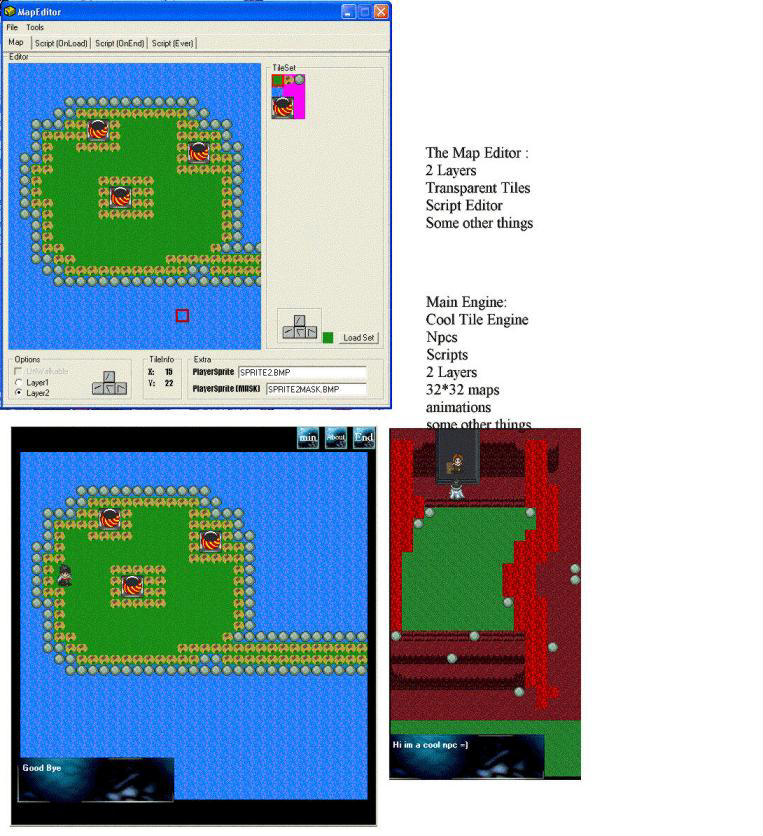



## RPG Engine with Editor

### Description

My new simple RPG engine... comes with a little map editor.It use vbscript for scripts..it can load npcs...2layers and so on..please vote =)

(because it doesnt run as fast as i wanted it..i have started a new engine using ddraw)
 
### More Info
 

             |
---                |---
**Submitted On**   |2002-05-26 19:08:46
**By**             |[SmokingFish](https://github.com/Planet-Source-Code/PSCIndex/blob/master/ByAuthor/smokingfish.md)
**Level**          |Beginner
**User Rating**    |5.0 (35 globes from 7 users)
**Compatibility**  |VB 5\.0, VB 6\.0
**Category**       |[Games](https://github.com/Planet-Source-Code/PSCIndex/blob/master/ByCategory/games__1-38.md)
**World**          |[Visual Basic](https://github.com/Planet-Source-Code/PSCIndex/blob/master/ByWorld/visual-basic.md)
**Archive File**   |[RPG\_Engine758034252002\.zip](https://github.com/Planet-Source-Code/smokingfish-rpg-engine-with-editor__1-34111/archive/master.zip)

